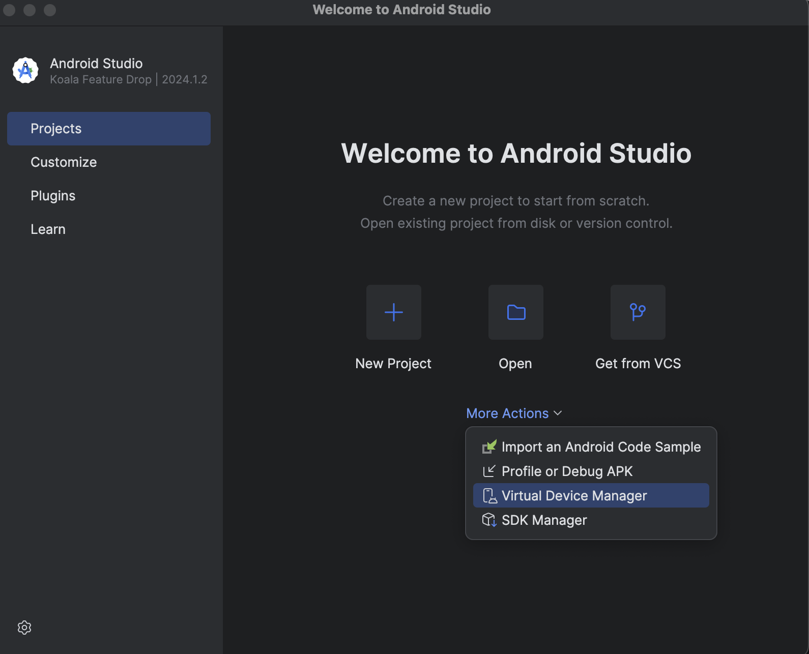
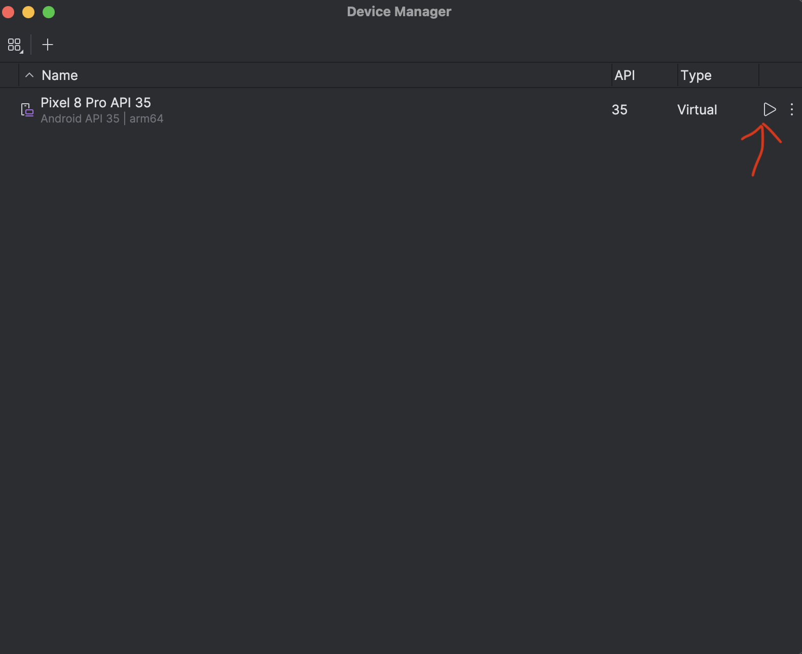
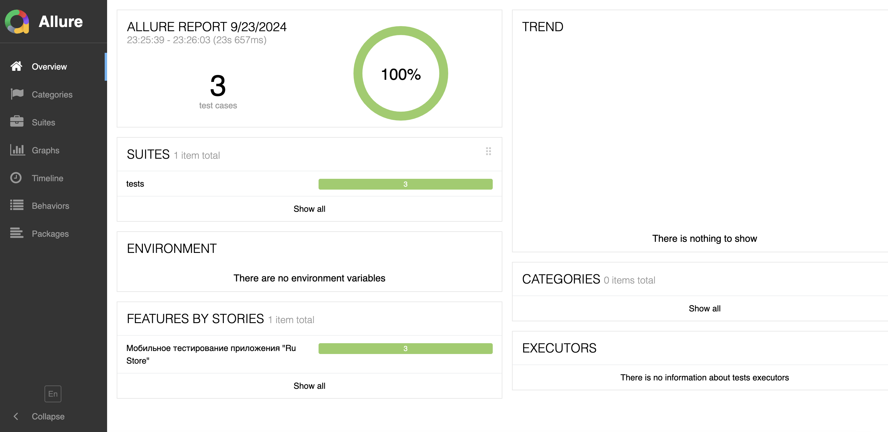
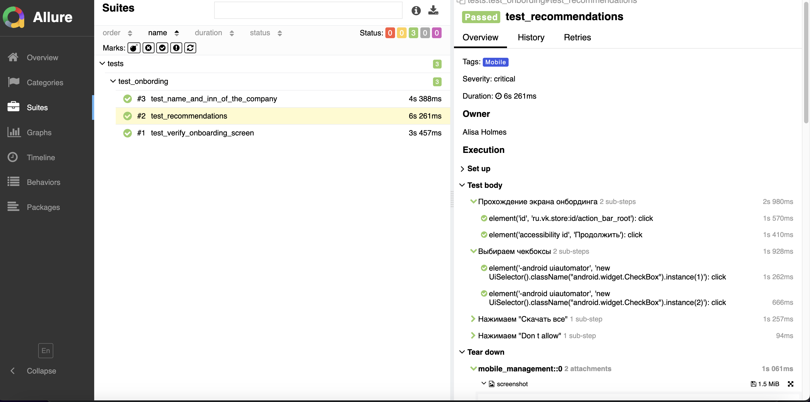

# Дипломный проект по мобильному тестированию приложения "RuStore"


## Содержание
- [Технологии и инструменты](#технологии-и-инструменты)
- [Список проверок](#список-проверок)
- [Настройка тестового стенда](#настройка-тестового-стенда)
- [Локальный запуск тестов и получение отчета](#локальный-запуск-тестов-и-получение-отчета)
- [Отчет в Allure-reports](#отчет-в-allure-reports)


## Технологии и инструменты
Проект реализован с использованием Python, PyCharm, Pytest, Appium, Android Studio, Allure Report.
<p align="left">


  
     


## Список проверок

- [x] Тестирование онбординга в приложении "RuStore"
- [x] Прохождение экрана рекомендаций и настройка уведомлений "RuStore"
- [x] Проверка информации о компании и ИНН "RuStore"

## Настройка тестового стенда

Отдельное руководство по установке Appium, Android Studio и созданию эмулятора мобильного устройства можно найти в интернете. Ниже приведена инструкция по запуску тестового окружения для проведения локальных тестов на эмуляторе.

<details><summary>1. Запуск Appium сервера</summary>
Для запуска Appium необходимо открыть командную строку и выполнить следующую команду:

```
appium --base-path "/wd/hub"
```
</details>

<details><summary>2. Запуск виртуального устройства</summary>
Для того чтобы запустить виртуальное устройство, необходимо открыть Android Studio и на странице Device Manager в строке с созданным устройством нажать на кнопку "Play"





</details>

## Локальный запуск тестов и получение отчета

<details><summary>1. Склонировать репозиторий</summary>

```
git clone git@github.com:alisaholmes/Mobil_Exam_RuStore.git
```
</details>


<details><summary>2. Создать и активировать виртуальное окружение, установить зависимости и запустить тесты через эмулятор</summary>

```
python -m venv .venv
source .venv/bin/activate
pip install -r requirements.txt
pytest --context=local_emulator
```
</details>

<details><summary>3. Сформировать отчет о прохождении тестов в allure</summary>

```
allure serve allure-results
```
Или 

```
allure generate
```
</details>

 После выполнения команды в проекте появится папка allure-report или автоматически откроется браузер с Allure-отчетом

## Отчет в Allure-reports

<details><summary>Отчет о результатах тестирования в Allure-reports</summary>



</details>
<details><summary>Тесты</summary>



</details>
